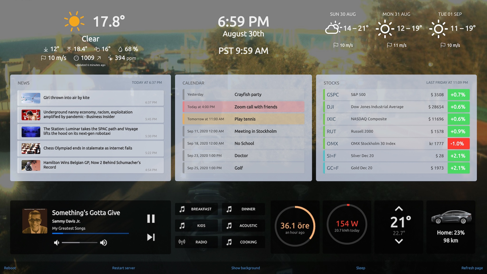

# Homeboard

This dashboard project is a hobby project I created to get a good-looking touchscreen for our kitchen with the latest news, family calendar, stocks and some home automation. I'm running it on a 24" Dell touchscreen powered by a Raspberry Pi 4, 4 GB. The screen is mounted flat on the wall in the kitchen with cables and RPi tucked away behind the monitor.

Feel free to fork, add feature requests, make pull requests and let me know of any ideas on how it can be improved.

## Sample


## Recommended hardware
- Raspberry Pi 4, 2 GB
- Micro HDMI to Standard HDMI cable
- [Dell P2418HT Touch 24"](https://www.dell.com/en-us/work/shop/dell-24-touch-monitor-p2418ht/apd/210-alcs/monitors-monitor-accessories)

## Software structure
The frontend is running as a [static node-server](https://github.com/expressjs/serve-static#readme) powered by [Framework7  and VueJS](https://framework7.io/vue/). 

Using a [web socket](https://github.com/socketio/socket.io#readme) connection, the frontend is communicating with a node-server keeping all data up to date from different sources and communicating with devices such as [Sonos](https://github.com/bencevans/node-sonos) speakers and home automation with [Tibber](https://tibber.com/). The background process is managed by [pm2 process manager](https://pm2.keymetrics.io/).

## Installation instructions

### On a fresh Raspberry Pi installation, start by changing your password
    passwd

### Change host name to "homeboard"
Change last row to "homeboard"
```
sudo nano /etc/hosts
sudo nano /etc/hostname
```

### Install Chrome browser and other X11 things
    sudo apt-get -y --fix-missing --no-install-recommends install matchbox chromium-browser cec-utils xinit x11-xserver-utils ttf-mscorefonts-installer xwit sqlite3 libnss3 xserver-xorg xserver-xorg-video-fbdev xinit pciutils xinput xfonts-100dpi xfonts-75dpi xfonts-scalable unclutter xdotool

### Update and install node, npm
    sudo apt update
    curl -o- https://raw.githubusercontent.com/nvm-sh/nvm/v0.35.3/install.sh | bash

    export NVM_DIR="$HOME/.nvm"
    [ -s "$NVM_DIR/nvm.sh" ] && \. "$NVM_DIR/nvm.sh"  # This loads nvm
    [ -s "$NVM_DIR/bash_completion" ] && \. "$NVM_DIR/bash_completion"  # This loads nvm bash_completion

    nvm install node
    npm install -g npm@latest

### Install pm2 background process manager
    npm install -g pm2
    pm2 startup
    # Copy and run the suggested command from the previous output - example:
    # sudo env PATH=$PATH:/home/pi/.nvm/versions/node/v14.5.0/bin /home/pi/.nvm/versions/node/v14.5.0/lib/node_modules/pm2/bin/pm2 startup systemd -u pi --hp /home/pi

### Clone git repository with latest code for the dashboard
    git clone https://github.com//blanck/homeboard.git ~/homeboard
    cd ~/homeboard
    git remote set-url origin git@github.com:blanck/homeboard.git

### Test to pull code from remote repo
    cd ~/homeboard/ && git reset HEAD --hard
    cd ~/homeboard/ && git pull --no-edit https://github.com/blanck/homeboard.git

### Install dependencies from repo
    npm install
    npm update

### Update caniuse library
    npx browserslist@latest --update-db

### Start background server (pm2)
    pm2 start '/home/pi/homeboard/server.js' 
    pm2 save

### Remove welcome screen at boot
    sudo rm /etc/xdg/autostart/piwiz.desktop

### Turn off Wi-Fi power save mode
    sudo sed -i "/exit 0/isudo iw wlan0 set power_save off" /etc/rc.local

### Autostart bash script on boot
    echo "@sh /home/pi/homeboard/start.sh &" | sudo tee -a /etc/xdg/lxsession/LXDE-pi/autostart

### Set temporary drive to ram to avoid sd disk error on crash/reboot
    echo "tmpfs    /tmp    tmpfs    defaults,noatime,nosuid,size=1024m    0 0" | sudo tee -a /etc/fstab
    echo "tmpfs    /var/log    tmpfs    defaults,noatime,nosuid,mode=0755,size=100m    0 0" | sudo tee -a /etc/fstab

# Configuration
### Set up your own config.js file
Copy the sample configuration file to your own local version protected from the public code
```
cp ~/homeboard/config.sample.js ~/homeboard/config.js
```
Edit the parameters, get your own API keys for services and change parameters to match your own preferences.
```
nano ~/homeboard/config.js
# ctrl + x - yes to save
# then restart server from bottom of the screen or in terminal with
pm2 restart server
```

# Connect to homeboard
You will have to connect to the homeboard computer using SSH.
Open up a terminal on your computer (PC/MAC)
```
ssh pi@homeboard.local
# enter yes first time then password
cd homeboard
```

# Local development
If you want to modify the code, configuration or add widgets it's recommended cloning a local copy of the repository on your computer.
```
git clone git@github.com:blanck/homeboard.git ~/Development/homeboard
cd ~/Development/homeboard/
npm install
```
Open two terminal windows and start the backend server in the first one
```
node server.js
```
Open the second terminal and run the development version of the dashboard
```
npm run dev
```


# Install splash screen
### Edit cmdline.txt to enable splash screen logo
    sudo sed -i " 1 s/.*/& disable_splash=1 logo.nologo consoleblank=0 loglevel=1/" /boot/cmdline.txt

    # Disable login prompt
    sudo systemctl disable getty@tty3
    # Install splash file handler
    sudo apt-get -y install fbi
    # Install splashservice from drive
    sudo pip install gdown
    sudo gdown -O /etc/systemd/system/splashscreen.service https://drive.google.com/uc?export=download\&id=13eWP-EtHfgUL6yl2-ptZhjkT3PJuR8rj
    # Download png file for splashscreen
    sudo cp ~/homeboard/assets-src/splash.png /opt/splash.png
    # Enable splash screen
    sudo systemctl enable splashscreen
    # Set desktop background
    export DISPLAY=:0 && pcmanfm --set-wallpaper /opt/splash.png

# Troubleshooting
### Other settings to try, one-by-one when screen looks bad
    sudo sed -i '/#disable_overscan/ c\disable_overscan=1' /boot/config.txt 
    # sudo nano /boot/config.txt 
    # disable_overscan=1
    # framebuffer_width=1920
    # framebuffer_height=1080
    # hdmi_force_hotplug=1
    # hdmi_group=1
    # hdmi_mode=31

### Manually running server
    # Stop pm2 server
    pm2 stop server
    cd ~/homeboard
    node server.js
    # troubleshoot error
    # Start pm2 server
    pm2 start server


### Tips
    # Taking remote screenshots from your local computer
    sudo apt install -y maim
    ssh pi@homeboard.local 'DISPLAY=:0.0 maim' > screen.png

