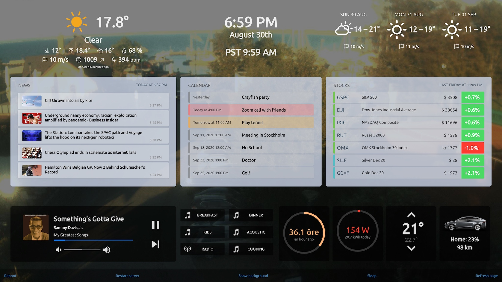

# Homeboard

A wall-mountable home dashboard with news, family calendar, stocks, weather, energy prices, music control, and more. Originally built for a 24" touchscreen on a Raspberry Pi; now also available as a native Android app for tablets.



Feel free to fork, file feature requests, send pull requests, or share ideas.

---

## Two ways to run it

### Android tablet (React Native) — recommended

The active version. Easiest to install: grab a prebuilt APK and sideload it.

1. Download the latest `homeboard-vX.Y.Z.apk` from [**Releases**](../../releases/latest).
2. Sideload to your tablet — either copy the APK over and tap it in the tablet's file manager, or:
   ```sh
   adb install homeboard-vX.Y.Z.apk
   ```
3. Open the app, walk through **Settings** to configure services (weather, calendar, Tibber, Sonos, news, etc.).

For build-from-source instructions, contributing, and developer docs see [`reactnative/README.md`](reactnative/README.md).

### Raspberry Pi (legacy web app)

The original version: a Vue/Framework7 web app served by a Node + socket.io backend, run as a kiosk on a Raspberry Pi 4 with a Dell P2418HT 24" touchscreen. Still maintained, but new development happens in the React Native version above.

Recommended hardware:

- Raspberry Pi 4 (2 GB or more)
- Micro HDMI to Standard HDMI cable
- [Dell P2418HT Touch 24"](https://www.dell.com/en-us/work/shop/dell-24-touch-monitor-p2418ht/apd/210-alcs/monitors-monitor-accessories) (or any HDMI touchscreen)

#### Software structure

The frontend runs as a [static node-server](https://github.com/expressjs/serve-static#readme) powered by [Framework7 + Vue](https://framework7.io/vue/). It talks over a [websocket](https://github.com/socketio/socket.io#readme) to a Node backend that pulls from external sources (news, weather, calendar) and devices like [Sonos](https://github.com/bencevans/node-sonos) speakers and [Tibber](https://tibber.com/). The background process is managed by [pm2](https://pm2.keymetrics.io/).

#### Installation on a fresh Raspberry Pi

##### Change the default password
    passwd

##### Set the hostname to "homeboard"
Change the last line in both files to `homeboard`:
```
sudo nano /etc/hosts
sudo nano /etc/hostname
```

##### Install Chromium and other X11 packages
    sudo apt-get -y --fix-missing --no-install-recommends install matchbox chromium-browser cec-utils xinit x11-xserver-utils ttf-mscorefonts-installer xwit sqlite3 libnss3 xserver-xorg xserver-xorg-video-fbdev xinit pciutils xinput xfonts-100dpi xfonts-75dpi xfonts-scalable unclutter xdotool

##### Install Node and npm via nvm
    sudo apt update
    curl -o- https://raw.githubusercontent.com/nvm-sh/nvm/v0.35.3/install.sh | bash

    export NVM_DIR="$HOME/.nvm"
    [ -s "$NVM_DIR/nvm.sh" ] && \. "$NVM_DIR/nvm.sh"
    [ -s "$NVM_DIR/bash_completion" ] && \. "$NVM_DIR/bash_completion"

    nvm install node
    npm install -g npm@latest

##### Install pm2
    npm install -g pm2
    pm2 startup
    # Then run the suggested `sudo env PATH=...` command pm2 prints.

##### Clone the repo
    git clone https://github.com/blanck/homeboard.git ~/homeboard
    cd ~/homeboard
    git remote set-url origin git@github.com:blanck/homeboard.git

##### Install dependencies
    npm install
    npm update
    npx browserslist@latest --update-db

##### Start the background server
    pm2 start '/home/pi/homeboard/server.js'
    pm2 save

##### Remove the first-run welcome screen
    sudo rm /etc/xdg/autostart/piwiz.desktop

##### Disable Wi-Fi power save
    sudo sed -i "/exit 0/isudo iw wlan0 set power_save off" /etc/rc.local

##### Autostart on boot
    echo "@sh /home/pi/homeboard/start.sh &" | sudo tee -a /etc/xdg/lxsession/LXDE-pi/autostart

##### Move /tmp and /var/log to RAM (avoids SD-card corruption on crash)
    echo "tmpfs    /tmp    tmpfs    defaults,noatime,nosuid,size=1024m    0 0" | sudo tee -a /etc/fstab
    echo "tmpfs    /var/log    tmpfs    defaults,noatime,nosuid,mode=0755,size=100m    0 0" | sudo tee -a /etc/fstab

#### Configuration

Copy the sample config and fill in your own API keys / preferences:

```
cp ~/homeboard/config.sample.js ~/homeboard/config.js
nano ~/homeboard/config.js
pm2 restart server
```

#### Remote access

```
ssh pi@homeboard.local
cd homeboard
```

#### Local development on your laptop

```
git clone git@github.com:blanck/homeboard.git ~/Development/homeboard
cd ~/Development/homeboard
npm install
node server.js          # one terminal — backend
npm run dev             # another terminal — frontend with HMR on localhost:8080
```

In Chrome, open DevTools → Toggle device toolbar (CMD/Ctrl + Shift + M) and set 1920×1080 to match the kiosk display.

#### Splash screen

```
sudo sed -i " 1 s/.*/& disable_splash=1 logo.nologo consoleblank=0 loglevel=1/" /boot/cmdline.txt
sudo systemctl disable getty@tty3
sudo apt-get -y install fbi
sudo pip install gdown
sudo gdown -O /etc/systemd/system/splashscreen.service https://drive.google.com/uc?export=download\&id=13eWP-EtHfgUL6yl2-ptZhjkT3PJuR8rj
sudo cp ~/homeboard/assets-src/splash.png /opt/splash.png
sudo systemctl enable splashscreen
export DISPLAY=:0 && pcmanfm --set-wallpaper /opt/splash.png
```

#### Troubleshooting

##### Bad-looking screen — try one at a time:
```
sudo sed -i '/#disable_overscan/ c\disable_overscan=1' /boot/config.txt
# Or edit /boot/config.txt manually and try:
#   disable_overscan=1
#   framebuffer_width=1920
#   framebuffer_height=1080
#   hdmi_force_hotplug=1
#   hdmi_group=1
#   hdmi_mode=31
```

##### `npm install` fails with node-gyp error on macOS
Missing Xcode command-line tools:
```
xcode-select --install
```

##### Manually run the server
```
pm2 stop server
cd ~/homeboard
node server.js          # see errors directly
pm2 start server
```

##### Take remote screenshots from your laptop
```
sudo apt install -y maim
ssh pi@homeboard.local 'DISPLAY=:0.0 maim' > screen.png
```
